<div align="center">

# Healthcare Business AI/ML Intelligence Platform

### Hospital Operations, Revenue Risk, Predictive Modeling, API Deployment, and AI Governance

[](https://www.python.org/)
[](sql/)
[](src/healthcare_api/)
[](models/)
[](docs/Phase6_Governance_Compliance.md)

An end-to-end applied AI and machine learning capstone that transforms raw hospital operations and billing data into a governed business intelligence and prediction platform.

</div>

---

## Executive Summary

This project builds a leadership-ready healthcare analytics platform that helps hospital teams understand patient-flow pressure, billing leakage, payer behavior, model-driven triage opportunities, deployment readiness, and long-term governance needs.

The solution starts with three raw operational datasets, creates a relational SQL analytics layer, performs exploratory data quality analysis, engineers model-ready features, trains two classification systems, evaluates explainability and fairness, deploys the models through a FastAPI service, and adds monitoring controls for data validation, drift detection, and auditability.

The final business deliverable is available here:

[`Healthcare_Insights_Report.docx`](Healthcare_Insights_Report.docx)

The evaluator-ready submission bundle is available here:

[`Healthcare_AI_Capstone_Submission.zip`](Healthcare_AI_Capstone_Submission.zip)

---

## Business Problem

Hospital leaders need trusted, queryable, and actionable intelligence across two connected domains:

- Operational pressure: which departments carry high volume, long length of stay, and elevated visit risk.
- Revenue leakage: which payers, claims, and billing patterns create rejection risk, approval gaps, and delayed cash flow.

The project addresses these needs with a governed analytics and AI workflow that supports decision-making without replacing clinical or finance review.

---

## Portfolio-Level Findings

| Area | Evidence | Leadership Meaning |
| --- | ---: | --- |
| Integrated encounters | 25,000 | Sufficient volume for SQL reporting, EDA, feature engineering, and model validation. |
| Modeling table | 69 columns | Combines demographics, visits, billing, engineered history, timing, and quality flags. |
| Total billed amount | $521.8M | Represents the gross claim exposure analyzed by the platform. |
| Total approved amount | $387.2M | Captures approved reimbursement in the dataset. |
| Revenue realization ratio | 74.2% | Indicates a material approval gap requiring payer and claim review. |
| Estimated revenue gap | $134.6M | Difference between billed and approved amounts. |
| High Risk visits | 5,034 | Operational triage population for staffing and review queues. |
| Rejected claims | 3,797 | Revenue-cycle risk population for pre-submission intervention. |

Key operational signals:

- General had the highest visit volume with 4,228 visits.
- Neurology had the highest average length of stay at 19.72 hours.
- ICU had the highest High Risk visit percentage at 20.79%.

Key financial signals:

- SecureLife had the highest claim rejection rate at 15.69%.
- Missing approved amount appears in 1,318 records.
- Missing payment days appears in 790 records.
- 72 high-billed records have zero or missing approvals.

---

## End-to-End Architecture

```mermaid
flowchart LR
    A["Raw CSV Inputs<br/>patients, visits, billing"] --> B["SQL Foundation<br/>schema, constraints, indexes, views"]
    B --> C["EDA and Data Quality<br/>profiling, missingness, outliers"]
    C --> D["Feature Engineering<br/>patient history, payer history, timing, quality flags"]
    D --> E["Model Development<br/>risk and claim classifiers"]
    E --> F["Evaluation and Explainability<br/>metrics, fairness, model card"]
    F --> G["FastAPI Deployment<br/>validated request/response schemas"]
    G --> H["Monitoring and Governance<br/>audit logs, drift, retraining strategy"]
    H --> I["Executive Insights<br/>business recommendations"]
```



---

## Project Phases and Deliverables

| Phase | Focus | Primary Deliverables |
| --- | --- | --- |
| Phase 1 | SQL analytics foundation | [`sql/`](sql/), [`database/hospital_operations.db`](database/hospital_operations.db), [`notebooks/Phase1_SQL.ipynb`](notebooks/Phase1_SQL.ipynb), [`docs/Phase1_SQL_Analytics_Layer.md`](docs/Phase1_SQL_Analytics_Layer.md) |
| Phase 2 | EDA and data quality | [`notebooks/01_eda.ipynb`](notebooks/01_eda.ipynb), [`scripts/build_features.py`](scripts/build_features.py), [`data_outputs/model_table.csv`](data_outputs/model_table.csv), [`docs/Phase2_EDA_Data_Quality_Report.md`](docs/Phase2_EDA_Data_Quality_Report.md) |
| Phase 3 | Classification model development | [`notebooks/02_risk_model.ipynb`](notebooks/02_risk_model.ipynb), [`notebooks/03_claim_model.ipynb`](notebooks/03_claim_model.ipynb), [`scripts/train_models.py`](scripts/train_models.py), [`models/`](models/), [`data_outputs/phase3/`](data_outputs/phase3/) |
| Phase 4 | Evaluation and explainability | [`scripts/evaluate_models.py`](scripts/evaluate_models.py), [`docs/Phase4_Model_Card.md`](docs/Phase4_Model_Card.md), [`docs/Phase4_Explainability_Summary.md`](docs/Phase4_Explainability_Summary.md), [`data_outputs/phase4/`](data_outputs/phase4/) |
| Phase 5 | API deployment and integration | [`src/healthcare_api/`](src/healthcare_api/), [`scripts/run_api.py`](scripts/run_api.py), [`scripts/smoke_test_api.py`](scripts/smoke_test_api.py), [`docs/Phase5_Deployment_Runbook.md`](docs/Phase5_Deployment_Runbook.md) |
| Phase 6 | Monitoring, drift, and governance | [`scripts/run_monitoring.py`](scripts/run_monitoring.py), [`docs/Phase6_Drift_Detection_Report.md`](docs/Phase6_Drift_Detection_Report.md), [`docs/Phase6_Governance_Compliance.md`](docs/Phase6_Governance_Compliance.md), [`data_outputs/phase6/`](data_outputs/phase6/) |
| Final | Executive business presentation | [`Healthcare_Insights_Report.docx`](Healthcare_Insights_Report.docx), [`scripts/create_executive_report.py`](scripts/create_executive_report.py), [`Healthcare_AI_Capstone_Submission.zip`](Healthcare_AI_Capstone_Submission.zip) |

---

## Machine Learning Summary

Two supervised classification systems were developed using time-based validation.

| Model | Business Purpose | Selected Method | Business-Critical Recall | Test Macro F1 | Deployment Role |
| --- | --- | --- | ---: | ---: | --- |
| Visit Risk Classification | Predict Low, Medium, or High visit risk | Logistic Regression | High Risk recall: 30.2% | 0.330 | Operational triage signal with human review |
| Claim Outcome Classification | Predict Paid, Pending, or Rejected claim outcome | Random Forest | Rejected recall: 49.2% | 0.357 | Revenue-cycle review queue prioritization |

Model interpretation:

- The models provide useful prioritization signals, but performance is not strong enough for autonomous clinical or billing decisions.
- The recommended use is decision support: dashboards, alerts, review queues, payer follow-up, and monitored pilot workflows.
- Phase 4 fairness analysis evaluates performance by gender, city, and insurance provider.

---

## API Service

The trained models are operationalized through FastAPI.

Verified endpoints:

| Endpoint | Purpose |
| --- | --- |
| `GET /health` | API and model health check |
| `GET /version` | API and model metadata |
| `POST /predict/risk` | Visit risk prediction |
| `POST /predict/claim` | Claim outcome prediction |
| `POST /predict/batch` | Batch risk and claim scoring |

Run locally:

```bash
python scripts/run_api.py
```

Smoke test:

```bash
python scripts/smoke_test_api.py
```

Sample payloads:

- [`docs/sample_payload_risk.json`](docs/sample_payload_risk.json)
- [`docs/sample_payload_claim.json`](docs/sample_payload_claim.json)

API documentation:

- [`docs/Phase5_API_Sample_Requests.md`](docs/Phase5_API_Sample_Requests.md)
- [`docs/Phase5_Deployment_Runbook.md`](docs/Phase5_Deployment_Runbook.md)

---

## Monitoring and Governance

Phase 6 adds controls for long-term AI reliability:

- Missing-value validation.
- Numeric range checks.
- Unseen-category detection.
- Feature drift monitoring.
- Prediction drift monitoring.
- Prediction audit-log summaries.
- Retraining and incident response strategy.

Latest monitoring results:

| Control | Result |
| --- | --- |
| Data validation checks | 93 total checks |
| Validation status | 84 pass, 7 warn, 2 fail |
| Feature drift | 10 drift-level features, 42 stable features |
| Risk prediction drift | Stable, PSI 0.020 |
| Claim prediction drift | Watch level, PSI 0.149 |
| Audit log | 6 prediction records, model versions present, no missing required metadata |

Governance documents:

- [`docs/Phase6_Drift_Detection_Report.md`](docs/Phase6_Drift_Detection_Report.md)
- [`docs/Phase6_Governance_Compliance.md`](docs/Phase6_Governance_Compliance.md)

---

## Repository Structure

```text
.
|-- Healthcare_Insights_Report.docx
|-- Healthcare_AI_Capstone_Submission.zip
|-- README_SUBMISSION.md
|-- patients.csv
|-- visits.csv
|-- billing.csv
|-- database/
|   `-- hospital_operations.db
|-- sql/
|   |-- phase1_schema.sql
|   |-- phase1_views.sql
|   `-- phase1_analysis_queries.sql
|-- notebooks/
|   |-- Phase1_SQL.ipynb
|   |-- 01_eda.ipynb
|   |-- 02_risk_model.ipynb
|   `-- 03_claim_model.ipynb
|-- scripts/
|   |-- build_phase1_database.py
|   |-- build_features.py
|   |-- train_models.py
|   |-- evaluate_models.py
|   |-- run_api.py
|   |-- run_monitoring.py
|   `-- create_executive_report.py
|-- src/
|   `-- healthcare_api/
|-- models/
|-- docs/
`-- data_outputs/
```

---

## Reproduce the Core Workflow

Use Python 3.12 with the dependencies in [`requirements.txt`](requirements.txt).

```bash
python -m venv .venv
.\.venv\Scripts\activate
pip install -r requirements.txt
```

Build the SQL foundation:

```bash
python scripts/build_phase1_database.py
python scripts/run_phase1_queries.py
```

Build the modeling table:

```bash
python scripts/build_features.py
```

Train and evaluate models:

```bash
python scripts/train_models.py
python scripts/evaluate_models.py
```

Run monitoring:

```bash
python scripts/run_monitoring.py
python scripts/create_phase6_reports.py
```

Generate the executive report:

```bash
python scripts/create_executive_report.py
```

---

## Strategic Recommendations

1. Launch a controlled 60-90 day pilot focused on ER/ICU operational triage and revenue-cycle claim review.
2. Use the claim model to prioritize payer-specific review queues, especially for high-bill and high-rejection patterns.
3. Remediate missing approval and payment fields before relying on executive financial dashboards.
4. Treat model outputs as decision-support signals only, with human review for High Risk and Rejected predictions.
5. Continue monitoring drift, fairness, and audit metadata before any broader production rollout.

---

## Responsible Use

This project is an applied AI and machine learning capstone. It is not a standalone clinical diagnosis system, not an automated claim denial engine, and not a substitute for hospital governance, privacy, security, legal, or clinical review.

The models are intended for:

- Operational triage support.
- Revenue-cycle review prioritization.
- Leadership reporting.
- Governance-ready analytics demonstration.

They are not intended for:

- Autonomous care decisions.
- Automated claim denial.
- Real patient deployment without institutional validation.

---

## Submission Notes

The final submission zip intentionally excludes Codex screenshots, `.git`, local virtual libraries, and transient server logs. It includes the project inputs, SQL assets, notebooks, generated outputs, reports, model artifacts, API code, monitoring evidence, audit log sample, final executive report, and submission manifest.

Submission manifest:

[`README_SUBMISSION.md`](README_SUBMISSION.md)
